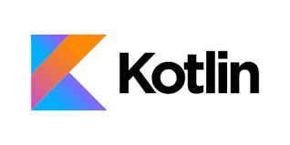

# kkangTeacherKotlinProgramming
## 1. Kotlin Study - Lets be Rolling again!

| Date | 2021. 09. 22 |
|------|:------------:|
| reference | TeacherKkangsBook
| description | Life's an Endless Learning!

## 2. [참고] YouTube 인강/강좌 - Online Lectures
1. [[깡샘]](https://bit.ly/3xhuTne) KkangsCoding 코틀린 프로그래밍 - YouTube
2. [[유다시티]](https://bit.ly/3wxEaHs) - Kotlin DashBoard(Classroom) - YouTube
3. [[조이스]](https://bit.ly/3fmmLLV) 코틀린 3강-1편 기본문법 - YouTube
4. [[노마드]](https://bit.ly/2T307An) 코틀린, 자바대체가능? 6분 이해하기! - YouTube

## 3. Google CodeLab for KOTLIN
> ### [[CodeLab]](https://bit.ly/3xpkNSh) Google Kotlin Bootcamp
> 스터디 커리큘럼 (Lesson 1-6 : 6주 완성)

  - kotlin Bootcamp for programmers: Welcome to the course
  - Lesson 1: Get started
  - Lesson 2: Kotlin basics
  - Lesson 3: Functions
  - Lesson 4: Classes and objects
  - Lesson 5.1: Extensions
  - Lesson 5.2: Generics
  - Lesson 6: Functional manipulation

## 3. TIL (Today I Learned ...)
1. 코틀린(Kotlin) 특징 및 장점, 전망 : [네이버 블로그](https://bit.ly/3ADXl5w)
2. 구글 Android 개발자 플랫폼 (커뮤니티) | [Android Developers](https://bit.ly/36zCFhz)
3. Kotlin Playground: [Kotlin Code Online](https://bit.ly/2SXdbY8)
4. [코드작성 규칙 (Coding Convention)](https://bit.ly/3CBD9Bu)
5. 코틀린[Kotlin] 강좌 [#1_변수와 자료형](https://bit.ly/36iTcWX)
6. 코틀린[Kotlin] 강좌 [#2_형변환과 배열](https://bit.ly/3xtii12)
7. 코틀린에는 static이 없다? - [companion object](https://bit.ly/3jjG7Tp)
